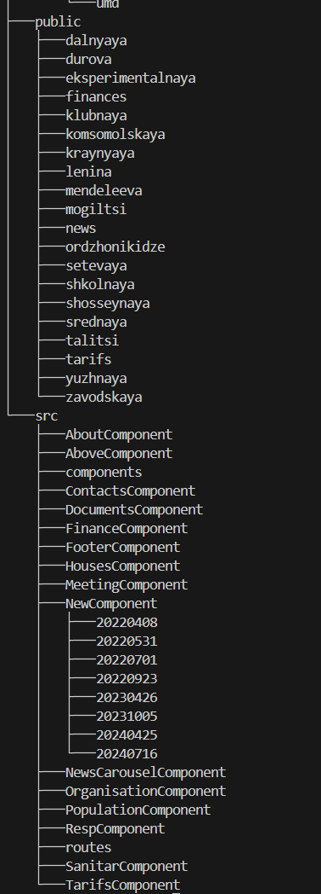

# Website for a house management company

## Usage

- Point to a menu section and click on it to open the desired page.
- On the main page there is a script from the Gosuslugi.ru website for sending messages with complaints.
## Installation
- git clone https://github.com/OlgaMakeikina/veha.git
- cd repository
- npm install

## Running 
npm start

## Build
npm run build

## Structure

### Technologies
- React/ JavaScript
- HTML/ CSS
